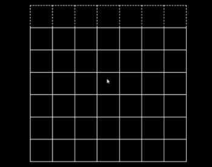

# Connect-Four
Connect Four is a two-player connection board game in which the players take turns dropping one colored disc from the top into a seven-column, six-row vertically suspended grid. The pieces fall straight down, occupying the lowest available space within the column. The objective of the game is to be the first to form a horizontal, vertical, or diagonal line of four of one's own discs.

### Demo

### PLay Connect-Four
[Play Connect-Four](https://kgmeinecke.github.io/Connect-Four/)
